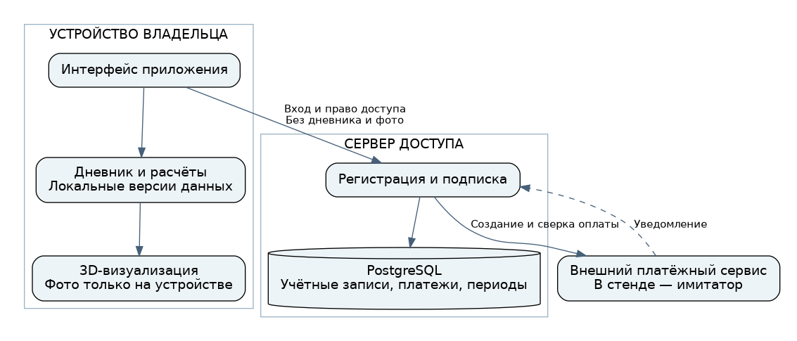

# Даниил Рогулин
## Фитнес-приложение: локальные данные, 3D-прогноз и подписка

**Кейс системного аналитика: вход в разрабатываемый продукт, проектирование API и платёжной интеграции.**

[PDF для отправки с резюме — 6 страниц](представление/Рогулин-Даниил-кейс-02.pdf) · [Краткая версия](представление/кейс.md) · [Доска задач](планирование/доска.html) · [Запуск стенда](стенд/README.md)

### Задача

Развить существующий прототип: дневник фактических тренировок и расчёты должны стать основой прогноза телосложения и 3D-визуализации. Добавляются регистрация, оплата и подписка на нескольких устройствах одного владельца. Фотографии остаются локальными всегда; тренировки, замеры и расчёты — локальными по умолчанию.

### Мой аналитический результат

Определены границы локального и серверного хранения, объекты и состояния оплаты, контракт API, правила повторов и восстановления после ошибок, локальные форматы дневника, требования к проверке расчётов, сценарии приёмки и организация работы по Scrum с практиками Kanban. Подготовлен отдельный исполняемый пример правил: регистрация → оплата → доступ на втором устройстве → повтор уведомления → возврат.

**Статус:** гипотетическое проектирование следующей версии по заданным условиям. Это не внедрение и не завершённое приложение. Имитатор оплаты не принимает деньги. Даты, тарифы, данные и план спринтов — демонстрационные. Материалы подготовлены с использованием ИИ; коммерческая работа команды и научная точность прогнозов не заявляются.



### Решение, которое стоит разобрать

**Подписка переносится между устройствами, но дневник от этого не передаётся на сервер.** Платёж, оплаченный период и текущие права доступа учитываются раздельно. Уведомление внешнего сервиса проверяется; повтор не создаёт второй период. Истечение подписки не уничтожает локальные записи и не лишает возможности прочитать или выгрузить дневник.

[Сценарий и состояния оплаты](документы/05-оплата-и-подписка.md) → [OpenAPI: запросы, ответы и ошибки](интерфейсы/openapi.json) → [Схема PostgreSQL](данные/001-сервер.sql) → [Проверки HTTP и транзакций](проверки/test_сервер.py).

[Русский справочник API и полей](интерфейсы/README.md) · [Обозначения в коде и схемах](документы/10-русские-названия.md)

### Практическая проверка

```bash
docker compose up --build -d --wait
docker compose exec api python -m стенд.сценарий
docker compose --profile test run --rm tests
```

Адрес API после запуска: `http://localhost:8080`; описание запросов: `/docs`. Нужен Docker с Compose. [Ограничения стенда и остановка](стенд/README.md). Для просмотра HTML-доски скачайте репозиторий и откройте `планирование/доска.html`: GitHub показывает её исходник. [Доска прямо в GitHub](планирование/доска.md).

### Подробные материалы

| Материал | Что подтверждает |
|---|---|
| [01. Контекст и исходный проект](документы/01-контекст.md) | Вход в существующую разработку, границы роли и источники вводных |
| [02. Требования](документы/02-требования.md) | Разделение правил продукта, функций и ограничений качества |
| [03. Архитектура и приватность](документы/03-архитектура.md) | Обоснованное размещение компонентов и данных |
| [04. Дневник, расчёты и прогноз](документы/04-дневник-и-расчёты.md) | Версии исходных данных, единицы, исключения, границы точности |
| [05. Оплата и состояния](документы/05-оплата-и-подписка.md) | Повторы, неизвестный исход, подтверждение, возврат, истечение |
| [06. Scrum и Kanban](документы/06-организация-разработки.md) | Цели спринтов, правила доски, ограничения начатой работы |
| [07. Проверка и связь требований](документы/07-проверки.md) | Требование → контракт → данные → проверка; границы доказательства |
| [08. Решения и открытые вопросы](документы/08-решения.md) | Принятые допущения и то, что требует решения владельца продукта |
| [09. Термины и источники](документы/09-словарь-и-источники.md) | Расшифровки и проверенные первоисточники |
| [Схемы и их исходники](схемы/README.md) | BPMN, UML-последовательность, состояния и связи данных |

### Что уже было и что добавлено только в кейсе

Исходная точка — [trening, версия 214a1a5](https://github.com/branch-danya-dev/trening/tree/214a1a5eea48f1cf115fdbff898b9d8d39547187). Расчётное ядро, локальное хранение и 3D-прототип существовали до кейса. Репозиторий `trening` не изменялся. Предлагаемая серверная часть продукта — C#/.NET; небольшой Python-стенд здесь лишь исполняет контракт и проверяет правила, не заменяет исходное приложение.

Гипотетическая функция продукта не считается выполненной от наличия документа или успешно работающего имитатора. [Что проверено и что ещё не проверялось](документы/07-проверки.md).
