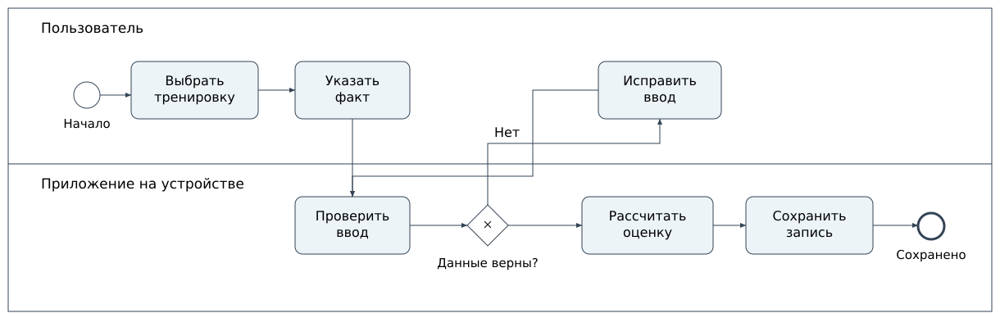

# 04. Локальный дневник, расчёты и визуализация

[Главная страница](../README.md) · [Схема записи](../contracts/workout.schema.json) · [Пример](../contracts/workout.example.json)

## Сценарий

Пользователь выбирает вид активности, указывает фактически выполненные отрезки либо время и дистанцию на улице, проверяет исходный профиль и сохраняет тренировку. Получает оценку, предупреждения и связь с прогнозом телосложения. План будущих тренировок хранится отдельно от выполненных.

Это BPMN-модель основного пути с проверкой ввода. Ошибка сохранения, переполнение хранилища и восстановление описаны отдельными условиями ФТ-16, не скрываются внутри «успешного» пути. [Редактируемый файл BPMN](../diagrams/workout.bpmn).

## Словарь локальных данных

| Поле | Смысл |
|---|---|
| workoutId | Неизменяемый идентификатор записи, создаваемый на устройстве |
| revision | Номер версии записи после изменения |
| recordedAt | Время факта с часовым поясом; не время отправки на сервер |
| activity / environment | Вид активности и условия выполнения |
| durationSeconds | Длительность в секундах |
| segments | Отрезки дорожки; скорость в км/ч, уклон в процентах, не градусах |
| weightKgAtWorkout | Масса, использованная для этой тренировки, в кг |
| actual | Признак фактически выполненной тренировки; для этой схемы только true |

В первом объёме поддерживаются walking/running и treadmill/outdoor. Числовые верхние границы схемы — технические ограничения ввода демонстрации, не доказанные границы применимости формул. Для силы и других активностей нужен другой состав данных; они не пересчитываются произвольным коэффициентом из ходьбы.

## Неизменяемый расчётный снимок

[Схема результата](../contracts/estimate.schema.json) хранит calculationId, workoutId, sourceRevision, исходную массу, methodVersion и отдельно активные, фоновые и общие калории. Вложенность и полнота всех исходных данных расширяются при подключении реального Core. Результат связан именно с версией тренировки. Изменение веса в профиле не меняет старую запись; пересчёт создаёт новый результат и сохраняет основание.

[Пример результата](../contracts/estimate.example.json) содержит **произвольные числа** для проверки арифметического равенства и связей. Значение 120 ккал не является оценкой этой тренировки. Поле syntheticFixture=true препятствует представлению такого ответа как результата приложения.

## Проверка точности — отдельная задача

В кейсе не проводится научная проверка формул. Требуется разделить:

1. Правильность программного расчёта по заданной формуле: единицы, округление, разбиение тренировки, воспроизводимость версии.
2. Применимость модели к конкретным условиям: вид активности, скорость, уклон, наличие поручней, качество исходных данных.
3. Фактическую ошибку относительно согласованного эталона на отдельной проверочной выборке.

Для третьего пункта нужно заранее выбрать метрики ошибки и условия сравнения. Разброс между несколькими формулами не называем доверительным интервалом. Показания часов не объявляем заведомо точным эталоном или заведомо неверными. Неопределённость показываем в результате. Точное количество сожжённого жира из одной оценки калорий не выводим.

## Контракт расчёт → 3D

Для текущего клиента предлагаем внутреннее сообщение: forecastId, calculationVersion, исходная версия профиля, дата начала, горизонт, предположения о питании и тренировках, ряд предполагаемых значений и предупреждения. 3D-модуль преобразует значения в форму и показывает «прогноз», а не «факт». Это внутреннее взаимодействие компонентов на устройстве, не сетевой API.

Одна и та же версия входа должна давать воспроизводимый численный результат. Замена внешнего вида модели не меняет исторические расчёты. Проверка правильного отображения и научная оценка предсказательной способности — разные задачи. Нейросетевая обработка вынесена за первый объём.

## Локальные сбои и развитие формата

Сохранение подтверждается только после завершения записи. Повтор использует тот же workoutId. При нехватке места данные ввода не исчезают без предупреждения. Перед обновлением формата нужна проверяемая миграция копии и возможность восстановить исходные записи. Фото не смешиваются с JSON дневника. Экспорт и локальное удаление требуют явного действия; выход из аккаунта не должен незаметно удалять личный архив.

Проверки схемы в репозитории не доказывают, что существующий интерфейс уже реализует эти правила.
