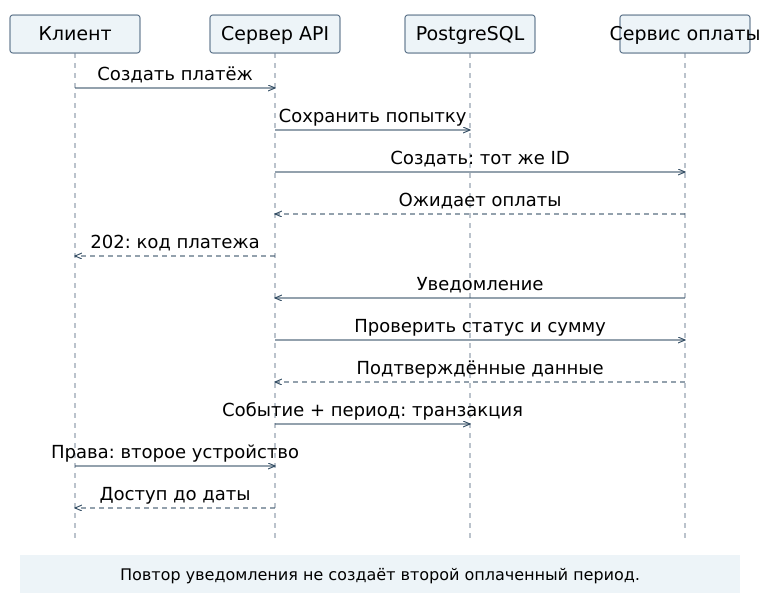

# 05. Регистрация, платёж и подписка

[Главная страница](../README.md) · [Контракт API](../интерфейсы/openapi.json) · [Запросы](../интерфейсы/запросы.http)

## Разделение состояний

Платёж — отдельная операция с внешней системой. Оплаченный период — интервал доступа, полученный за подтверждённый платёж. Текущие права — результат проверки периода и его отзыва на конкретный момент. Статус страницы оплаты не является источником истины.

[Исходник UML](../схемы/последовательность-оплаты.puml) · [Состояния платежа](../схемы/состояния-платежа.png) · [Связи таблиц](../схемы/связи-данных.png)

| Состояние | Основание | Следующее действие |
|---|---|---|
| Исход создания неизвестен (`creating`) | Намерение сохранено локально сервером; результат создания у платёжного сервиса неизвестен | Повторить ту же операцию с прежним ключом, провести сверку |
| Ожидание оплаты (`pending`) | Платёжный сервис подтвердил создание, но не оплату | Ожидать уведомление или сверку; не выдавать период |
| Оплата подтверждена (`succeeded`) | Доверенная сверка подтверждает успех и реквизиты | В одной транзакции зафиксировать событие и единственный период |
| Платёж отменён (`canceled`) | Платёжный сервис подтвердил отмену до успеха | Период не создавать; новую попытку пользователь начинает отдельно |
| Полный возврат (`refunded`) | Подтверждён полный возврат | Отозвать период этого платежа; не восстанавливать по позднему сигналу |

Частичные возвраты, оспаривание платежа, автоматическое продление и смена тарифа посередине периода требуют отдельного проектирования. Они не поддерживаются имитатором и не объявлены реализованными.

## Ключевые запросы

| Метод | Назначение |
|---|---|
| POST /v1/auth/challenges | Запрос одноразового кода, одинаковая форма для входа и регистрации |
| POST /v1/auth/sessions | Подтверждение кода и открытие сеанса |
| DELETE /v1/auth/sessions/current | Завершение текущего сеанса |
| GET /v1/me | Текущая учётная запись |
| GET /v1/plans | Условные тарифы и длительность |
| POST /v1/payments | Создание/повтор операции с Idempotency-Key |
| GET /v1/payments/{payment_id} | Состояние только своего платежа |
| POST /v1/provider/notifications | Сигнал внешней системы, после которого нужна сверка |
| GET /v1/entitlements | Текущие права владельца |

Создание возвращает 202: операция принята, но это не подтверждение оплаты. Ошибки имеют поля code/message. Примеры: 401 — неверный или просроченный сеанс; 404 — объект не найден либо чужой; 409 — конфликт ключа/основания; 422 — нарушен формат; 429 — превышено ограничение входа; 503 — сверка с платёжным сервисом сейчас невозможна.

## Надёжность

Ключ повторяемости задаётся для пары «владелец + ключ». Одинаковый ключ с другим тарифом даёт конфликт. Сумма и длительность фиксируются в платеже на момент создания, а не берутся из произвольных полей клиента. Повтор не пересчитывает уже зафиксированную цену по новому тарифу.

Запись намерения сохраняется до обращения к платёжному сервису. При обрыве остаётся состояние «исход создания неизвестен» (`creating`), а не ложный отказ. Внешний идентификатор/ключ стабильны, поэтому повтор продолжает ту же операцию. Промышленный срок хранения ключей и политика восстановления должны учитывать гарантии выбранного платёжного сервиса.

При подтверждении блокируется запись владельца, затем платежа. Это предотвращает пересечение одновременно покупаемых периодов. Уникальность payment_id в subscription_periods не допускает второй период даже при другом eventId. Событие и период сохраняются атомарно. Неверная сумма, валюта или ссылка не дают доступа.

Сверка пропущенных уведомлений — обязательный внутренний процесс. В стенде она запускается вручную; это не утверждение о работающем планировщике. После перезапуска реального процесса задача должна возобновляться по незавершённым операциям.

## Периоды, возвраты и автономность

Ручное продление добавляет период после максимальной даты конца неотозванных периодов, либо от текущего момента. Границы [начало, конец). Полный возврат отзывает только соответствующий период; оставшиеся покупки не переносятся незаметно. Если возник разрыв, текущий доступ отсутствует до начала следующего периода. Это предложенная политика, требующая согласования.

Приложение сохраняет чтение и выгрузку локальных записей после истечения. Защищённое автономное разрешение — [отдельный пункт архитектуры](03-архитектура.md); ответ стенда не имеет подписи и для этого не подходит.

## Внешний сервис и имитатор — не одно и то же

DemoPay — вымышленный сервис этого стенда. Его X-Provider-Key и поля eventId/paymentId **не выдаются за контракт ЮKassa**. Для адаптера выбранного поставщика нужны отдельное соответствие полей, проверка подлинности, реквизитов и текущего статуса.

В качестве первоисточника рассмотрена [документация уведомлений ЮKassa](https://yookassa.ru/developers/using-api/webhooks): уведомления требуют подтверждения и проверки. [Формат взаимодействия](https://yookassa.ru/developers/using-api/interaction-format) описывает ключи повторяемости и неопределённость при ошибке. Коммерческий поставщик, страна, валюта и юридический порядок оплаты пока не выбраны. Реальных запросов туда стенд не выполняет.
