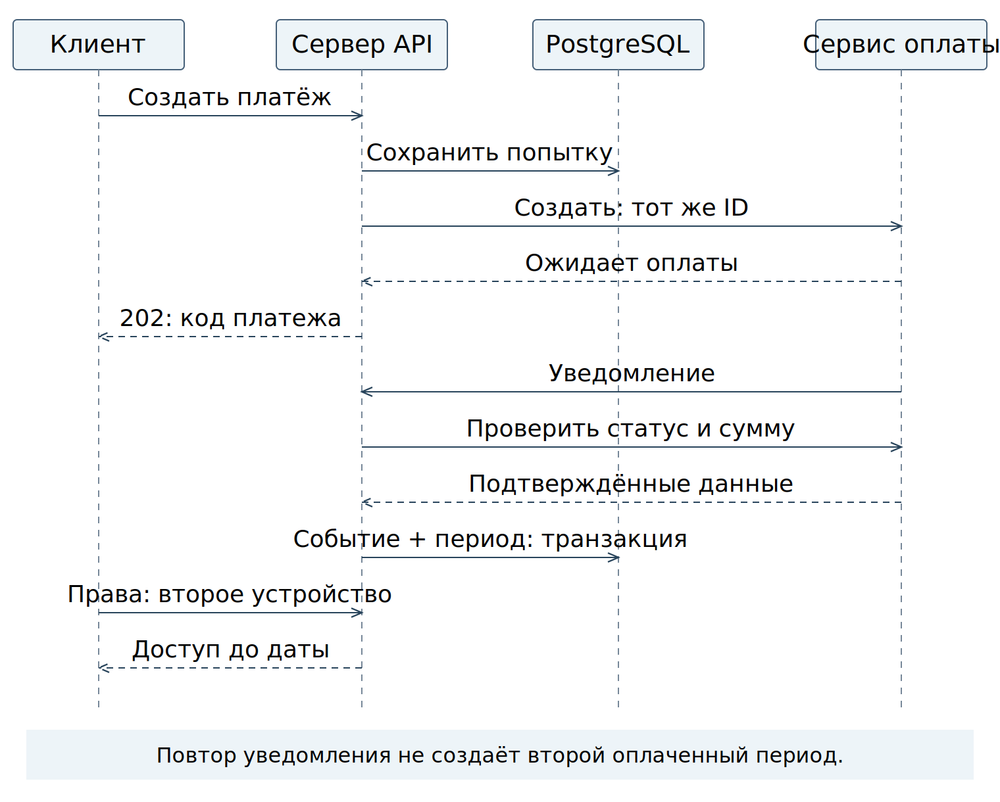

# Краткое представление кейса

[Главная страница](../README.md) · [PDF](Рогулин-Даниил-кейс-02.pdf)

## Тренировки, 3D-прогноз и подписка

### Задача
Спроектировать следующую версию приложения: дневник реальных тренировок, воспроизводимые расчёты и визуальный прогноз изменений тела. Добавить регистрацию, оплату и доступ на нескольких устройствах одного владельца, не превращая личный дневник в обязательную серверную базу.

### Исходная точка
Существующий проект trening: C#/.NET, расчётное ядро, интерфейсы и браузерный 3D-прототип. Профиль и фотографии хранятся на устройстве. Зафиксирована версия 214a1a5; исходный код не менялся в рамках кейса.

### Аналитический вклад
Разделены локальные и серверные сведения. Разработаны требования, описания API — программного интерфейса, данные и состояния оплаты, правила повторов и восстановления, сценарии приёмки и план коротких этапов Scrum с управлением движением задач по Kanban. Отдельный демонстрационный стенд позволяет проверить выбранные правила.

### Граница доказательства
Это гипотетическое проектирование, не завершённый коммерческий проект. Платёжный сервис имитируется, числа в примерах вымышлены. Научная точность прогнозов и опыт реальной Scrum-команды не заявлены.

[Полный кейс](../README.md)

[Контекст и источник](../документы/01-контекст.md)

## Подписка не означает передачу дневника

### На устройстве
Тренировки, замеры, расчётные снимки и 3D-представление. Фотографии остаются локальными всегда, включая уменьшенные копии. Подключение подписки не даёт согласия на отправку дневника.

### На сервере
Минимальная учётная запись, сеансы, тарифы, платежи и оплаченные периоды. Реквизиты карты принимает внешний платёжный сервис. На втором устройстве появляется доступ по подписке, но не локальные тренировки.

### Выбранная простота
Для продукта сохраняется C#/.NET и рассматривается один сервер с PostgreSQL. Микросервисы и брокер не добавлены без причины. Python-стенд — исполняемый пример контракта, не замена технологической основы приложения.

[Архитектура и приватность](../документы/03-архитектура.md)

[Серверные таблицы](../данные/001-сервер.sql)

## От риска к проверяемому контракту

### Риск → решение
Потерянный ответ или повтор уведомления может привести к второй оплате либо лишнему периоду доступа. Решение: стабильный ключ операции, доверенная сверка, отдельные состояния платежа и периода, атомарное сохранение.

### Требования → проверка
ФТ-04–ФТ-07: повтор создания возвращает тот же идентификатор платежа; неподтверждённая оплата не даёт доступа; любой повтор уведомления создаёт не больше одного периода; неизвестный исход сохраняется для сверки. Проверяются HTTP-ответы, конкурентные запросы и ограничения PostgreSQL.

### Исключения
Полный возврат отзывает свой период. Позднее уведомление не восстанавливает доступ. Пропуск уведомления исправляет сверка. Стенд не реализует частичные возвраты, настоящую кассу и автоматические списания.

[Контракт OpenAPI](../интерфейсы/openapi.json)

[Правила оплаты](../документы/05-оплата-и-подписка.md)

## Расчёт воспроизводим, прогноз объясним

### Сценарий пользователя
Выбрать ходьбу или бег, указать выполненные отрезки либо дистанцию и время, сохранить тренировку, увидеть оценку с предупреждениями и связь с прогнозом телосложения. План будущей активности не считается фактом.

### Данные и версии
Запись имеет постоянный идентификатор, номер редакции, время с часовым поясом и единицы измерения. Расчёт связан с исходной версией тренировки, массой на тот момент и версией метода. Изменение профиля не переписывает историю; пересчёт оформляется явно.

### Что означает точность
Отдельно проверяются корректность программы, применимость метода к условиям тренировки и фактическая ошибка относительно согласованного эталона. Без эталона и проверочной выборки процент точности не назначается. Произвольные числа стенда проверяют структуру, а не расход калорий.

### Роль 3D и будущей нейросети
3D-визуализация остаётся в первом объёме как отличительная особенность. Она получает результат прогноза и его предположения, но не меняет численные расчёты. Нейросетевая обработка — отдельное развитие; убедительное изображение само по себе не доказывает качество прогноза.

[Локальные данные и расчёты](../документы/04-дневник-и-расчёты.md)

[BPMN записи тренировки](../схемы/тренировка.bpmn)

## Scrum и Kanban без выдуманной истории

### Цели последовательных спринтов
1. Записать тренировку и получить понятный расчёт с базовой 3D-связью. 2. Получить оплаченный доступ на своих устройствах. 3. Корректно пережить локальные сбои, истечение, возврат и пропуск уведомления. Двухнедельная длительность предложена для обсуждения, сроки выпуска не обещаны.

### Доска задач
Требует уточнения → Готово к обсуждению → В работе → Проверка → Завершено. Предложен предел: две задачи в работе и две на проверке. Заблокированные задачи учитываются в этом количестве. Причина препятствия видна в карточке.

### Когда функция действительно завершена
Выполнены условия приёмки, изменение интегрировано с приложением, пройдены проверки, документация соответствует поведению, личные данные не передаются без основания. Успех имитатора не означает готовность функции продукта.

### Что можно проверить в кейсе
Список из 12 задач связан с требованиями и материалами. Есть локальная интерактивная доска с проверкой ограничений, сохранением и выгрузкой. Исходные статусы описывают план; реальные спринты, скорость команды и отзывы участников не выдуманы.

[Работа по Scrum и Kanban](../документы/06-организация-разработки.md)

[Доска в GitHub](../планирование/доска.md)

## Материалы и границы результата

### Документы
Контекст, требования, архитектура, локальные данные, платёжная интеграция, организация разработки, прослеживаемость проверок, решения и словарь. Схемы: архитектура, связи таблиц, состояния платежа, UML-последовательность и BPMN-процесс.

### Исполняемая проверка
Docker Compose запускает API, отдельный имитатор оплаты и реально используемую PostgreSQL. Пример проходит регистрацию, оплату, повтор уведомления, вход на втором устройстве и возврат. Проверки сверяют контракты, локальные форматы, HTTP-ответы и транзакционные правила.

### Что не реализовано
Нет изменений исходного приложения, реальной почты и кассы, защищённого автономного разрешения, облачного дневника и нейросетевой модели. Не выполнены научное испытание точности, нагрузочная проверка и полный аудит безопасности. Это перечисленные границы, а не скрытые достижения.

### Автор и материалы
Даниил Рогулин. Кейс подготовлен по собственному проекту с использованием ИИ. Для технического обсуждения: показать риск, найти связанное требование, открыть контракт, воспроизвести проверку и объяснить ограничение выбранного решения.

### Обозначения
API — программный интерфейс; HTTP — протокол запросов и ответов; SQL — язык работы с базой данных. UML — стандарт моделирования систем; BPMN — стандарт описания процессов. Docker Compose совместно запускает компоненты в контейнерах — изолированных окружениях.

[Репозиторий и инструкции](../README.md)

[Проверки и ограничения](../документы/07-проверки.md)

[Источники](../документы/09-словарь-и-источники.md)
